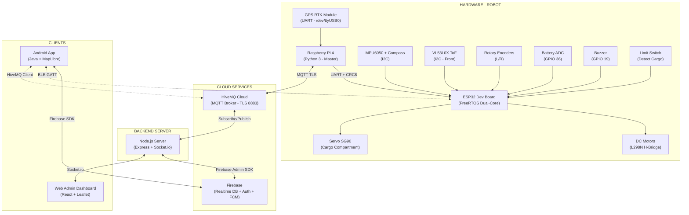
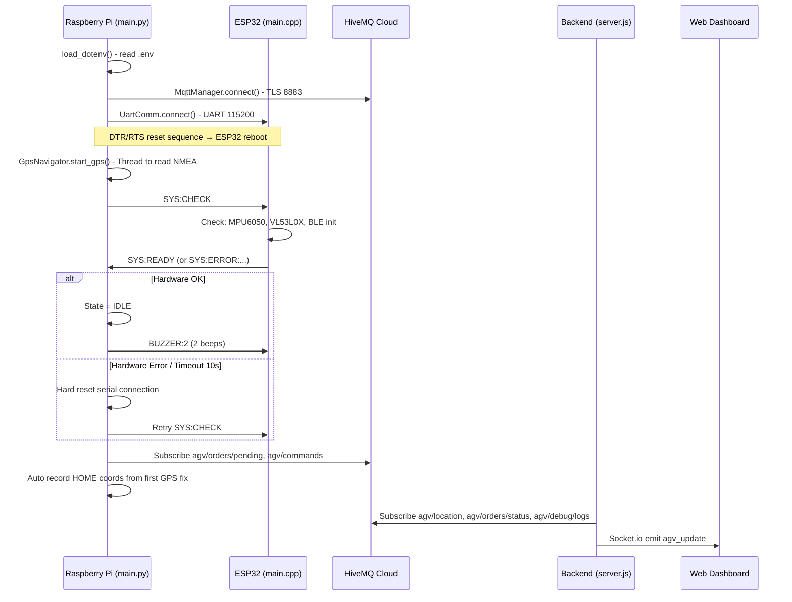
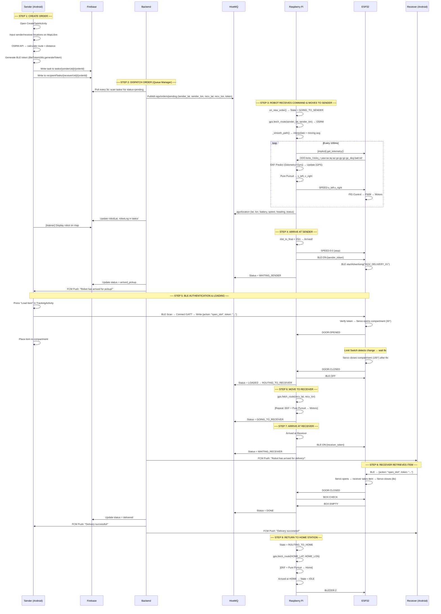

# TECHNICAL ANALYSIS REPORT
## Automated Guided Vehicle (AGV) Delivery System

---

## Part 1: Project Overview

### 1.1 Main Objective

The project aims to build a complete **Automated Guided Vehicle (AGV) delivery system**, allowing users to place delivery orders via an Android mobile application. The robot will automatically navigate to the sender's location, receive the goods, and then transport them to the receiver's location — all **without manual intervention** during the delivery process.

The system is designed following a **Multi-tier IoT Architecture**, which includes: robot hardware (ESP32 + Raspberry Pi), intermediate backend (Node.js), real-time database (Firebase Realtime Database), an Android application for end-users, and a web dashboard for administrators.

### 1.2 Core Features

| # | Feature | Description |
|---|-----------|-------|
| 1 | **Android App Ordering** | Users input pickup/drop-off locations, the system calculates the route via OSRM API and creates an order on Firebase |
| 2 | **GPS + EKF Auto Navigation** | The robot uses an **Extended Kalman Filter (EKF)** combining GPS, Encoders, and an IMU Gyro to determine position, then uses a **Pure Pursuit Controller** to follow the route |
| 3 | **BLE (Bluetooth Low Energy) Authentication** | The robot opens its cargo compartment only when the user correctly authenticates a **token** via a BLE connection between the phone and the ESP32 |
| 4 | **Real-time Tracking** | Robot location, order status, battery, and speed are continuously updated via **MQTT → Backend → Firebase → App** |
| 5 | **Obstacle Detection** | A Time-of-Flight (VL53L0X) sensor stops the robot when detecting an obstacle < 30cm |
| 6 | **Web Admin Dashboard** | A real-time web interface with a Leaflet map, system logs, fleet management, and testing/debugging features |
| 7 | **Push Notification (FCM)** | Order status notifications sent to both the sender and receiver via Firebase Cloud Messaging |
| 8 | **State Machine** | The robot operates based on a **Finite State Machine** with 9+ distinct states from INIT → IDLE → GOING_TO_SENDER → ... → RETURNING |

---

## Part 2: Directory Structure & Important Files

### 2.1 Directory Tree (Summary)

```
final-year-project/
├── robot/                              # ── HARDWARE & FIRMWARE ──
│   ├── pi_master/                      # Main control program (Raspberry Pi 4)
│   │   ├── main.py                     # ★ Main State Machine - AGV core
│   │   ├── gps_nav.py                  # ★ EKF + Pure Pursuit Navigation
│   │   ├── mqtt_mgr.py                 # MQTT connection management (Pi ↔ Cloud)
│   │   ├── uart_comm.py                # UART communication with ESP32 (CRC8)
│   │   ├── .env                        # MQTT config, GPS port, HOME coords
│   │   ├── requirements.txt            # Python libraries
│   │   └── run_robot.sh                # Startup script
│   │
│   └── arduino_slave/                  # ESP32 microcontroller firmware
│       ├── src/main.cpp                # ★ FreeRTOS: PID Motor, IMU, ToF, BLE, Servo
│       └── platformio.ini              # PlatformIO configuration
│
├── AutoDeliveryApp-final/              # ── ANDROID APP ──
│   └── app/src/main/java/com/example/autodeliveryapp/
│       ├── MainActivity.java           # Home page, active orders list
│       ├── CreateTaskActivity.java     # ★ Order creation: MapLibre map, OSRM routing
│       ├── TrackingActivity.java       # ★ Real-time tracking: map, timeline, BLE
│       ├── LoginActivity.java          # Firebase Auth login
│       ├── RegisterActivity.java       # Account registration
│       ├── HistoryActivity.java        # Order history
│       ├── ProfileActivity.java        # Profile page
│       ├── NotificationActivity.java   # Notifications list
│       ├── FCMNotificationService.java # Push Notification Service
│       ├── Constants.java              # Constants: DB_URL, API Key, locations
│       ├── ble/                        # ── BLE MODULE ──
│       │   ├── BleManager.java         # ★ Scan, connect BLE to robot
│       │   ├── BleGattClient.java      # GATT Client: write + notify
│       │   ├── BleProtocol.java        # JSON payload protocol
│       │   ├── BleConstants.java       # Service/Characteristic UUIDs
│       │   ├── BleTokenUtils.java      # Generate random token
│       │   └── BlePermissionHelper.java# Request BLE permissions for Android 12+
│       ├── mqtt/                       # ── MQTT MODULE (Android) ──
│       │   ├── MqttManager.java        # HiveMQ MQTT Client (Singleton)
│       │   ├── MqttTopics.java         # Topic name definitions
│       │   ├── MqttConfig.java         # Broker configuration
│       │   ├── MqttPayloadParser.java  # Parse/serialize JSON
│       │   ├── MqttListener.java       # Callback interface
│       │   └── MqttFirebaseBridge.java # MQTT → Firebase bridge
│       ├── model/                      # ── DATA MODEL ──
│       │   ├── RobotCommand.java       # Command sent to robot
│       │   ├── RobotTelemetry.java     # Sensor data from robot
│       │   ├── RobotStatusMessage.java # Status notification
│       │   └── RobotAck.java           # Acknowledgement response
│       ├── adapters/                   # RecyclerView adapters
│       ├── data/                       # Data classes
│       └── utils/                      # Helper utilities
│
├── web-admin/                          # ── WEB DASHBOARD ──
│   ├── backend/
│   │   ├── server.js                   # ★ Node.js: MQTT Bridge + Firebase + Socket.io
│   │   ├── package.json                # Dependencies: express, mqtt, firebase-admin, socket.io
│   │   └── serviceAccountKey.json      # Firebase Admin credentials
│   └── frontend/
│       ├── src/
│       │   ├── App.tsx                 # ★ Root component: Socket.io, state management
│       │   ├── types.ts                # TypeScript type definitions (AGV, Order, Log...)
│       │   └── components/
│       │       ├── MapContainer.tsx    # ★ Leaflet map: AGV marker, route, home
│       │       ├── Header.tsx          # Top bar: tabs, stats, settings
│       │       ├── SidebarLeft.tsx     # Fleet list, pending orders
│       │       ├── SidebarRight.tsx    # AGV details, order info
│       │       ├── TestingView.tsx     # Debug: GPS override, rotation test
│       │       ├── DeployModal.tsx     # Deploy new AGV
│       │       ├── DispatchLogsView.tsx# System logs viewer
│       │       ├── FleetHealthView.tsx # Battery/health dashboard
│       │       ├── MaintenanceView.tsx # Maintenance records
│       │       └── PendingOrdersList.tsx# Pending tasks panel
│       └── package.json               # React 19, Vite, Leaflet, TailwindCSS, socket.io-client
```

### 2.2 Role of Core Files

| File | Role |
|------|---------|
| [main.py](file:///e:/final-year-project/robot/pi_master/main.py) | **Central brain** of the AGV. Implements `AgvStateMachine` with 9+ states, orchestrates the entire delivery flow |
| [gps_nav.py](file:///e:/final-year-project/robot/pi_master/gps_nav.py) | **Navigation** module: 4-state EKF (x, y, θ, bias_gz), Pure Pursuit Controller, OSRM routing, path smoothing |
| [uart_comm.py](file:///e:/final-year-project/robot/pi_master/uart_comm.py) | **CRC8-checked UART** communication between Pi and ESP32, parses telemetry (ODO, DOOR, WARN, BOX, SYS) |
| [mqtt_mgr.py](file:///e:/final-year-project/robot/pi_master/mqtt_mgr.py) | Manages **MQTT TLS** connection to HiveMQ Cloud, publish/subscribe to agv/* topics |
| [main.cpp](file:///e:/final-year-project/robot/arduino_slave/src/main.cpp) | ESP32 Firmware: **FreeRTOS dual-core** — Core 0: UART + Telemetry, Core 1: PID motor control, IMU, ToF, Servo, BLE |
| [server.js](file:///e:/final-year-project/web-admin/backend/server.js) | Backend **bridge**: MQTT subscriber → Socket.io emitter → Firebase updater, Queue Manager, FCM Push |
| [CreateTaskActivity.java](file:///e:/final-year-project/AutoDeliveryApp-final/app/src/main/java/com/example/autodeliveryapp/CreateTaskActivity.java) | Create order: **MapLibre** map, OSRM route calculation, reverse geocoding, BLE token generation |
| [TrackingActivity.java](file:///e:/final-year-project/AutoDeliveryApp-final/app/src/main/java/com/example/autodeliveryapp/TrackingActivity.java) | Real-time tracking: live map, status timeline, BLE authentication button, route split (traversed/remaining) |

---

## Part 3: System Architecture & Technologies

### 3.1 Overall Architecture Diagram



### 3.2 Main Components

#### 3.2.1 Motor Control Module (ESP32 - Core 1)

- **PID Controller** with constants `Kp=3.5, Ki=0.8, Kd=0.2` controls the speed of each wheel based on encoder feedback
- **PID Loop**: 50ms (20 Hz), synchronized with telemetry sending to Pi
- **Anti-windup**: `errorL_integral` is clamped within [-200, 200]
- **Emergency Stop**: Automatically stops when an obstacle is detected (from ToF) or when target speed = 0

#### 3.2.2 Sensor & Navigation Module (ESP32 + Raspberry Pi)

| Sensor | Function | Frequency |
|-----------|-----------|----------|
| **GPS RTK** (NMEA GGA) | Global coordinates (lat, lon) | ~1 Hz (from GPS module) |
| **MPU6050** (Accel + Gyro) | 3-axis Acceleration + 3-axis Angular Velocity | ~200 Hz |
| **Compass 0x2C** (QMC5883L) | Digital compass → Madgwick AHRS filter → Yaw | ~200 Hz |
| **VL53L0X ToF** | Forward distance (mm) → obstacle detection < 300mm | ~200 Hz |
| **Rotary Encoders** (L/R) | Tick counting → calculate speed/distance | ISR (interrupt-driven) |
| **Limit Switch** | Detect cargo in compartment (LOW = loaded) | On-demand |
| **Battery ADC** | Read battery voltage → calculate % | 1 Hz |

**Sensor Fusion (EKF)** — Implemented in [gps_nav.py](file:///e:/final-year-project/robot/pi_master/gps_nav.py#L216-L317):
- **State Vector**: `[x, y, θ, bias_gz]` (4 state variables)
- **Prediction Step**: Based on Odometry (encoder ticks) + Gyro Z → Predict next position
- **Update Step**: GPS coordinates (when new data is available) → Correct EKF state
- **Course Over Ground (COG)**: Calculate heading from 2 consecutive GPS points when moving > 0.5m

#### 3.2.3 Navigation Module - Pure Pursuit Controller

Implemented in [gps_nav.py](file:///e:/final-year-project/robot/pi_master/gps_nav.py#L319-L403):

- **Look-ahead Distance**: 1.0m
- **Path Smoothing**: Linear interpolation (target spacing 0.2m) + Moving Average filter (window size 5)
- **Curvature-based Steering**: `κ = 2·y_local / L_ad²` → `ω = v_base · κ`
- **Spin-in-Place**: When heading error > 45° (0.8 rad), robot rotates in place to align
- **Speed Reduction**: Speed inversely proportional to curvature when `|κ| > 1.0`

#### 3.2.4 Network/UI Communication

| Channel | Protocol | Purpose | QoS |
|------|-----------|----------|-----|
| Pi ↔ ESP32 | **UART 115200** + CRC8 | SPEED, BLE, BOX commands; ODO, DOOR, WARN telemetry | N/A |
| Pi ↔ Cloud | **MQTT TLS (port 8883)** | Publish: location, status; Subscribe: orders, commands | QoS 0/1 |
| Backend ↔ Frontend | **Socket.io (WebSocket)** | Real-time AGV updates, logs, commands | N/A |
| Backend ↔ Firebase | **Firebase Admin SDK** | Read/write tasks, push FCM | N/A |
| Android ↔ Firebase | **Firebase Android SDK** | Auth, Realtime DB, FCM | N/A |
| Android ↔ ESP32 | **BLE GATT** | Token verification, open/close compartment | N/A |
| Android ↔ MQTT | **HiveMQ MQTT Client** | Subscribe robot telemetry (backup channel) | QoS 0/1 |

### 3.3 Technology Summary Table

| Layer | Language | Framework / Library | Notes |
|------|----------|----------------------|---------|
| **ESP32 Firmware** | C++ | Arduino, FreeRTOS, BLE (ESP32 SDK), Adafruit VL53L0X, Madgwick AHRS, ESP32Servo, ArduinoJson | PlatformIO build, 2 tasks dual-core |
| **Raspberry Pi Master** | Python 3 | pyserial, pynmea2, paho-mqtt, numpy, requests, python-dotenv | EKF/Pure Pursuit runs on Pi |
| **Backend Server** | JavaScript (ES Modules) | Node.js, Express, Socket.io, mqtt.js, firebase-admin | Bridge: MQTT → Socket.io → Firebase |
| **Web Admin Frontend** | TypeScript / TSX | React 19, Vite, TailwindCSS v4, Leaflet, Socket.io-client, Lucide-React, Motion | Real-time dashboard |
| **Android App** | Java | Firebase (Auth, Realtime DB, Cloud Messaging), MapLibre GL 11.0, HiveMQ MQTT Client, Google Play Services Location | MapLibre replaces Google Maps |
| **Cloud Services** | — | HiveMQ Cloud (MQTT Broker TLS), Firebase Realtime Database, Firebase Authentication, Firebase Cloud Messaging | Managed services |
| **Routing API** | — | OSRM (Open Source Routing Machine), MapTiler (Geocoding, Map Tiles) | Free, public API |

---

## Part 4: System Workflow

### 4.1 System Startup Flow



### 4.2 Execution Flow for a Delivery Task (End-to-End)



### 4.3 State Machine Transition Table

| # | State | Description | Transition |
|---|-----------|-------|-------------|
| 1 | `INIT` | Check ESP32 hardware (SYS:CHECK) | → `IDLE` (if READY) |
| 2 | `IDLE` | Wait for order, motors stopped, BLE off | → `GOING_TO_SENDER` (when order received) |
| 3 | `GOING_TO_SENDER` | Move to sender's location | → `WAITING_SENDER` (when arrived) |
| 4 | `WAITING_SENDER` | Wait for sender to load item (BLE ON) | → `ROUTING_TO_RECEIVER` (when DOOR:CLOSED) / → `ROUTING_TO_HOME` (timeout 600s) |
| 5 | `ROUTING_TO_RECEIVER` | Calculate route to receiver | → `GOING_TO_RECEIVER` (when routed) |
| 6 | `GOING_TO_RECEIVER` | Move to receiver's location | → `WAITING_RECEIVER` (when arrived) |
| 7 | `WAITING_RECEIVER` | Wait for receiver to retrieve item (BLE ON) | → `ROUTING_TO_HOME` (when DOOR:CLOSED or timeout) |
| 8 | `ROUTING_TO_HOME` | Calculate route back to home station | → `RETURNING` (when routed) |
| 9 | `RETURNING` | Return to HOME | → `IDLE` (when arrived) |
| 10 | `TEST_ROTATION` | Test mode: rotate to specified angle | → `IDLE` (when canceled) |

### 4.4 MQTT Topics Table

| Topic | Publisher | Subscriber | QoS | Payload Content |
|-------|----------|------------|-----|----------|
| `agv/location` | Pi | Backend | 0 | `{lat, lon, battery, speed, heading, status, homeLat, homeLon}` |
| `agv/orders/pending` | Backend | Pi | 1 | `{id, sender_lat, sender_lon, recv_lat, recv_lon, sender_token, recv_token}` |
| `agv/orders/status` | Pi | Backend | 1 | `{order_id, status}` |
| `agv/commands` | Backend/Web | Pi | 1 | `{action: "force_state"/"ble_on"/"override_gps"/"set_home"/...}` |
| `agv/debug/logs` | Pi | Backend | 0 | Plaintext log messages |
| `agv/status/compartment1` | Pi | Backend | 1 | `{order_id, status: "FULL"/"EMPTY"}` |

---

## Part 5: Highlights & Limitations

### 5.1 Highlights

#### ✅ Clear Layered Architecture
The system strictly separates 4 layers: **Firmware (ESP32)** → **Master Controller (Pi)** → **Cloud Bridge (Node.js)** → **Client (Android/Web)**. Each layer has specific responsibilities:
- ESP32 handles **low-level real-time** operations (PID motor, sensor reading, BLE)
- Pi handles **high-level logic** (State Machine, Navigation, MQTT)
- Backend handles **orchestration** (Queue Manager, Firebase sync, Push Notifications)

This facilitates debugging and makes it easy to replace individual modules without affecting the whole system.

#### ✅ 4-State Extended Kalman Filter (EKF)
Implementing the EKF with state vector `[x, y, θ, bias_gz]` on the Pi is a notable technical point:
- **Prediction**: Uses odometry (encoder ticks) + gyro z to predict position
- **Update**: Uses GPS (x, y) and Course Over Ground (θ) for correction
- **Bias estimation**: Automatically estimates gyroscope drift bias
- The system correctly handles **angle wrapping** (normalize −π → π) in both prediction and update steps

#### ✅ Pure Pursuit Controller with Path Smoothing
- The route from OSRM is **interpolated** (0.2m spacing) and then **smoothed** using a moving average → reduces jerk during turns
- The controller automatically executes **spin-in-place** when heading error > 45° → reduces the risk of deviating from the path
- Speed is **inversely proportional to curvature** → ensures safety during sharp turns

#### ✅ FreeRTOS Dual-Core on ESP32
- **Core 0**: Communication task — UART from Pi + Telemetry broadcast (10ms loop)
- **Core 1**: Control task — ToF, IMU, PID, Servo, Buzzer (5ms loop, ~200Hz)
- Properly utilizes **Mutex** (`dataMutex`) to avoid race conditions between the two cores
- **Interrupt-driven encoder** (`IRAM_ATTR`) ensures no ticks are missed

#### ✅ BLE Token-based Authentication
Complete cargo security mechanism:
1. App generates a **random token** when an order is created → saved to Firebase
2. Backend sends the token via **MQTT → Pi → UART → ESP32**
3. ESP32 stores `localToken` and **only opens the servo** when the BLE client sends the correct token
4. The BLE protocol utilizes **JSON payloads** via GATT Write + Notify

#### ✅ CRC8-Checked UART Communication
Both the Pi ([uart_comm.py](file:///e:/final-year-project/robot/pi_master/uart_comm.py#L9-L18)) and ESP32 ([main.cpp](file:///e:/final-year-project/robot/arduino_slave/src/main.cpp#L263-L285)) implement a **CRC-8 checksum** (polynomial 0x07) for every UART message. Frames with CRC errors are **dropped silently** → increases data transmission reliability.

#### ✅ Comprehensive Web Dashboard
The admin dashboard provides:
- **Real-time Leaflet map** showing AGV position, route, and home marker
- **GPS Override**: Simulates GPS location for testing without actual physical movement
- **Force State**: Forces the robot to jump to any state for debugging
- **Rotation Test**: Tests rotating the robot to a specified angle
- **System Logs**: Real-time viewing of ESP32 + Pi logs via MQTT

#### ✅ Two-way Push Notification Architecture
The Backend sends **FCM data messages** (not notification messages) → allows the app to receive pushes even when in the **background/killed** state. The FCM token is saved to Firebase upon login, or cached into SharedPreferences if not logged in.

### 5.2 Limitations & Future Development

#### ⚠️ Arrival Threshold is Too Large
In [gps_nav.py line 334](file:///e:/final-year-project/robot/pi_master/gps_nav.py#L334), the `dist_to_final < 15.0` (15 meters) threshold is quite loose for a precise delivery problem. This is appropriate for **standalone GPS** (error margin ~3-9m), but if upgraded to **RTK GPS** (error margin ~2cm), this threshold could be reduced to 1-2m.

> **Future Direction**: Use an RTK GPS module (e.g., u-blox ZED-F9P) and reduce the arrival threshold to 1-2m.

#### ⚠️ Actual Speed not Read from Encoders
In [main.py lines 198-199](file:///e:/final-year-project/robot/pi_master/main.py#L198-L199), the speed sent to MQTT is always `0.0` because the actual velocity is not calculated from encoder deltas. The EKF calculates velocity internally but doesn't expose it externally.

> **Future Direction**: Calculate `current_speed = (delta_ticks_L + delta_ticks_R) / 2 * meters_per_tick / dt` and include it in the telemetry.

#### ⚠️ System Only Supports 1 Robot (Single AGV)
The entire MQTT architecture uses **fixed topics** (`agv/location`, `agv/orders/pending`) instead of topics with robot ID parameters (`agv/{robot_id}/location`). The backend also maintains only a single `agvState` variable. This limits the system to a **single robot**.

> **Future Direction**: Add robot IDs to MQTT topics, convert `agvState` to `Map<robotId, AGV>`, and implement a task assignment algorithm for a multi-robot fleet.

#### ⚠️ No Re-routing Mechanism
When the robot encounters an obstacle, the system simply **stops in place** and waits for the obstacle to disappear. There is no active **obstacle avoidance** logic or **new route calculation**.

> **Future Direction**: Integrate obstacle avoidance algorithms (VFH, DWA) or recall OSRM with intermediate waypoints.

#### ⚠️ Lack of Unit & Integration Tests
The robot source code, backend, and app all **lack automated test files**. This poses risks during refactoring or feature expansion.

> **Future Direction**: Write unit tests for the EKF, Pure Pursuit (using Python pytest), test UART protocol, and test Firebase integration.

#### ⚠️ Simplistic Path Smoothing
Currently, a **moving average** (window size 5) is used to smooth the route. This method can cause **corner cutting** at sharp turns, leading the robot to deviate from the road.

> **Future Direction**: Replace with **Cubic Spline Interpolation** or **Bézier Curves** to better preserve the route's geometry.

#### ⚠️ Hardcoded Calibration Constants
Constants like `meters_per_tick = 0.002` and `wheelbase = 0.20` in [gps_nav.py](file:///e:/final-year-project/robot/pi_master/gps_nav.py#L77-L78) are hardcoded. If the wheels or mechanical structure changes, the source code must be modified.

> **Future Direction**: Move these to the `.env` file or build an **auto-calibration** routine upon startup.

#### ⚠️ BLE Payload Not Encrypted
The BLE token is transmitted as **plaintext JSON**. Anyone with a BLE sniffer can intercept the token.

> **Future Direction**: Encrypt the payload using **AES-128** or utilize **BLE Secure Connection** (LE Secure Connections with ECDH key exchange).

---

### 5.3 Evaluation Summary

| Criterion | Evaluation |
|----------|----------|
| **Source Code Organization** | ⭐⭐⭐⭐ Good — Clear module separation (nav, uart, mqtt, ble), consistent naming conventions |
| **Navigation Algorithms** | ⭐⭐⭐⭐ Good — EKF + Pure Pursuit is an academically sound choice |
| **System Architecture** | ⭐⭐⭐⭐ Good — Standard Multi-tier IoT architecture |
| **Security** | ⭐⭐⭐ Average — MQTT TLS is good, but BLE lacks encryption |
| **Scalability** | ⭐⭐ Needs Improvement — Single-robot design, lacks multi-AGV support |
| **Testing** | ⭐⭐ Needs Improvement — Lacks automated testing, relies solely on manual testing |
| **Completeness** | ⭐⭐⭐⭐⭐ Excellent — End-to-end flow from app → cloud → robot → BLE → delivery |
